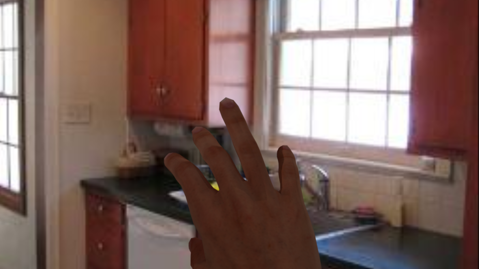
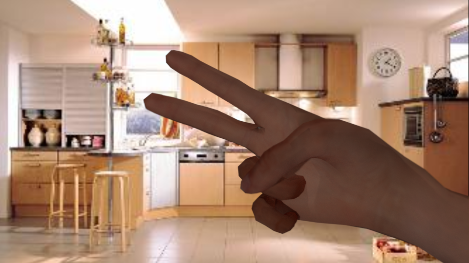

# How to use

## Initialization
First, generate your config file

`python3 settings.py`

This will create a config.ini file at the root of the folder where the folder structure is stored
(each folder has it's absolute path as value in the folders section of the config)

## Requirements

### [Blender](https://www.blender.org/)

Version : 2.78a

## Python

Version : 3.5

### Packages

- matplotlib

- numpy

- opencv-python (to read .exr files)

- and more !

## Usage

For demo purposes, I provide one scene containing a [mixamo character](https://www.mixamo.com/#/?page=1&query=liam&type=Character) (liam) with cameras, lights and actions.

To start rendering you can launch the following command (assuming blender is in your path and you are in the project folder).

```shell
blender data/blender-assets/scenes/liam-trimmed-anim.blend -b -noaudio -P  blender-scripts/render_animated.py -- --person liam --trimmed --background_folder data/blender-assets/backgrounds
```


This renderes several outputs in the 'annots' folder:

- [rgb](data/blender-renders/annots/rgb) contains the RGB rendered images
- [segm](data/blender-renders/annots/segm) contains the skin segmentation
- [2Dcoord](data/blender-renders/annots/2Dcoord) contains the 2D coordinates
- [3Dcoord](data/blender-renders/annots/3Dcoord) contains the 3D coordinates (rescaled to realistic human scales in the metric system)
- [depth](data/blender-renders/annots/depth) contains the depth map

## Results

Some images we generated with another mixamo character (andromeda) with backgrounds from the [LSUN dataset](http://www.yf.io/p/lsun)





